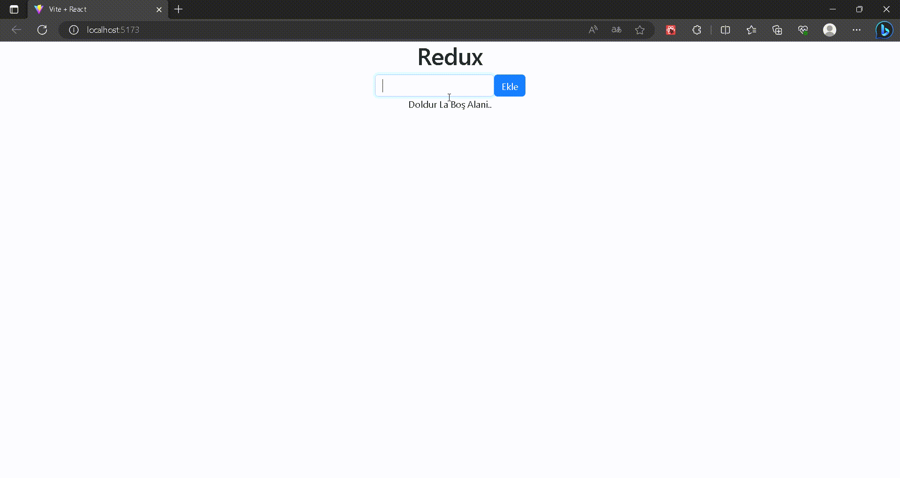

# State Yönetimi

- State: uygulama içersindeki bileşenlerin sahip oldukları özellikler ve bilgiler

- Prop Drilling: bileşenlerde yukarıdan aşağıya prop yönetimiyle veri gönderimi

- Context Api: uygulamadaki statelerin yönetildiği merkezi br state yönetim araci

- Redux: uygulamadaki bileşenlerin sahip olduğu gerekli statelerin merkezi bir store'da tutulmasını sağlar.

# Neden Redux

- Kod Tekrarını Önler
- Performansı artırır
- bileşen içerisindeki karışıklığı azaltır
- state yönetimi daha kolay ve anlaşılır hale gelir

# Bilinmesi Gerekenler

- Store: uygulamanın bütün bileşenleri tarafından erişilibilenve değiştirilen merkezi state

- Action: Storu güncellemek için reducura gönderdiğimiz haber
-- 2 değere sahip bir objedir
--type: eylemin görevi neyse onu tamamladığımız string(addTodo veya deletedTodo)
--payload: reducura eylemi gönderirken yanında eylem ile alakalı veriyi gönderdiğimz değer

- Dispatch: eylemlerin gerçekleştiğini reducura haber vermemizi sağlayan method

- Reducer: gönderilen aksiyonları type değerine göre analiz edip store günceller

- Subscribe: redux uygulama durumunu merkezi bir depoda saklar
bileşenlerin bu duruma erişmesi gerektiğinde  useSlector: kancası kullanılır.

# Kurulum

- redux- react-redux paketleri indirilir
- store oluşturulur
- storede kullanilicak reducer oluşturulur
- store projeye tanitilir

<h1>Proje Gif</h1>

